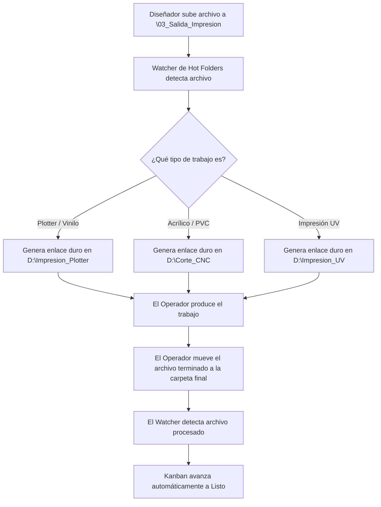

# Manual de Usuario - Sistema de Gestión de Producción TaskCore

¡Bienvenido al manual oficial del sistema de gestión de producción de **TaskCore**! Este documento explica cómo interactúan los usuarios con el sistema, cómo se gestionan los archivos físicos automáticamente en el servidor y qué esperar de cada una de las automatizaciones de fondo.

---

## 1. El Flujo de Trabajo y la Estructura de Carpetas

El sistema organiza los archivos de producción de manera lógica y centralizada. Esto evita la pérdida de información y garantiza que los operarios de las máquinas siempre impriman la versión aprobada.

### A. Estructura de un Pedido
Cada vez que se registra o confirma un Pedido en la recepción del sistema, se genera físicamente una carpeta maestra en el servidor con el siguiente formato:

```
[Ruta Base]/Pedidos/[AÑO]/[CLIENTE] - [ID_CLIENTE]/[ID_PEDIDO] - [REF_PROYECTO]/
```

Dentro de cada carpeta de pedido, el sistema crea automáticamente tres subcarpetas clave:

1. **`\01_Diseno_Editable\`**: 
   * **Destinado a**: Diseñadores.
   * **Uso**: Aquí se deben guardar los archivos fuentes editables (.ai, .psd, .cdr, .pdf editable).
   * **Acceso**: Solo el Diseñador asignado y el Administrador modifican esta carpeta.

2. **`\02_Muestras_Aprobacion\`**:
   * **Destinado a**: Diseñador / Clientes / Ventas.
   * **Uso**: Contiene las previsualizaciones rápidas en JPG o PNG. Cuando el diseñador sube una muestra al Kanban, el sistema la guarda aquí para su aprobación.

3. **`\03_Salida_Impresion\`**:
   * **Destinado a**: Diseñadores / Operadores.
   * **Uso**: Contiene los archivos finales listos para producción. Para órdenes que requieren procesos combinados (Impresión y Corte), se divide internamente en:
     * **`\Impresion\`**: Donde se guardan los archivos destinados a impresión final (ej. Plotter o Impresora UV). El sistema los vincula automáticamente con la etiqueta `[IMP]`.
     * **`\Corte\`**: Donde se guardan los archivos vectorizados de corte (ej. Plotter de corte o CNC). El sistema los vincula automáticamente con la etiqueta `[CORTE]`.
   * **Gatillo de Automatización**: Al colocar archivos dentro de estas subcarpetas, el sistema los deriva de inmediato a las máquinas correspondientes en la red de producción.

---

## 2. Automatización de Flujos de Trabajo (Hot Folders)

Los directorios automáticos (Hot Folders) actúan como un puente directo entre el software y las computadoras conectadas a las máquinas físicas (Plotter de Impresión, Máquina UV, CNC).



### ¿Cómo funciona en el día a día?

1. **Paso del Diseñador**: Cuando el cliente aprueba el diseño, el diseñador prepara el archivo de impresión final y lo coloca en la carpeta `\03_Salida_Impresion` del pedido.
2. **Distribución Automática**: El sistema (mediante un monitoreador en segundo plano) detecta el nuevo archivo, lee la base de datos para ver de qué tipo de trabajo se trata y genera un **enlace duro (hard link)** automáticamente en la carpeta de la máquina respectiva (ej. `E:\Impresion_Plotter`).
   * *Nota: Los enlaces duros no duplican el espacio en el disco duro; actúan como accesos directos de bajo nivel.*
3. **Paso del Operador**: El operador de la máquina abre la carpeta local del Hot Folder (`E:\Impresion_Plotter`), abre el archivo y manda a imprimir. 
4. **Finalización Automática**: Al terminar la impresión, el operador arrastra el archivo a la subcarpeta `\Terminado` o carpeta de salida designada.
5. **Gatillo de Cierre**: El sistema detecta el archivo en la carpeta de terminados y mueve automáticamente la tarjeta del Kanban a **Listo para Instalar / Entregar**.

---

## 3. Roles en el Sistema y sus Responsabilidad

Para mantener la seguridad financiera e informática, cada rol tiene permisos específicos:

### 👤 1. Administrador
* **Responsabilidad**: Supervisión técnica de la empresa, usuarios y copias de seguridad de base de datos.
* **Qué hace**: Configura tarifas base de materiales y acabados, aprueba/desactiva cuentas de usuarios, puede resolver cotizaciones complejas, y realiza mantenimiento del sistema (generación y restauración de copias de seguridad SQL). Tiene acceso total.

### 👤 2. Gerencia
* **Responsabilidad**: Salud económica del negocio, flujo operativo y gestión de personal.
* **Qué hace**: Monitorea cuentas por cobrar y métricas de facturación. Aprueba y resuelve cotizaciones especiales asignándoles un precio final, y puede activar o desactivar la opción de ocultar los importes a Ventas. Puede avanzar o retroceder estados en el Kanban. Permite dar de alta, editar y dar de baja cuentas de empleados (usuarios).
* *Seguridad*: Comparte el privilegio exclusivo con el Administrador para controlar la visibilidad financiera. En la administración de usuarios, solo puede gestionar aquellos que pertenezcan a rangos inferiores a Gerencia (no puede gestionar cuentas de administradores ni de otros gerentes).

### 👤 3. Ventas / Recepción
* **Responsabilidad**: Atención al cliente y entrada de pedidos.
* **Qué hace**: Registra pedidos manuales o procesa los borradores de pedidos en espera. Revisa las medidas y el precio estimado antes de enviar a producción.
* *Seguridad*: No posee permisos para ocultar o mostrar precios de facturación (el checkbox está oculto en la interfaz y bloqueado en el backend), ni para resolver incidencias/cotizaciones especiales. Si la Gerencia o el Administrador habilitan la opción "Ocultar Precio a Ventas" en una orden, el vendedor verá los importes censurados con la etiqueta `[RESERVADO]`.

### 👤 4. Diseñador
* **Responsabilidad**: Vectorización, adaptación y preparación técnica de artes.
* **Qué hace**: Sube imágenes de muestras en el Kanban, se asigna tareas de diseño, y guarda los archivos finales en la carpeta de producción usando el protocolo `taskcore://` que le abre la carpeta local del proyecto con un solo clic.
* *Seguridad*: Cero visibilidad financiera. No puede ver precios, abonos ni deudas de los clientes.

### 👤 5. Operador de Producción
* **Responsabilidad**: Fabricación física del producto (impresión, corte, acabados).
* **Qué hace**: Recibe los archivos automáticamente en su cola de Hot Folders y produce el material. Al finalizar la impresión o corte, el sistema se encarga de actualizar el Kanban.
* *Seguridad*: Cero visibilidad financiera. Solo ve medidas, material, copias y especificaciones técnicas (ej. ojetes, laminado).

### 👤 6. Instalador
* **Responsabilidad**: Despacho, logística y montaje en campo.
* **Qué hace**: Usa una interfaz simplificada para dispositivos móviles (`/instalador`). Al terminar un montaje, adjunta fotos del trabajo terminado en el sitio como prueba de entrega y marca la orden como **Completado**, cerrando el ciclo de vida del pedido.
* *Seguridad*: Cero visibilidad financiera. Solo ve el nombre, teléfono, dirección del cliente y la guía visual de instalación.

---

## 4. Módulo de Diagnóstico y Reparación Técnica

Para artículos que requieren revisión y reparación física en laboratorios, TaskCore implementa un flujo secuencial e interactivo en el Tablero Kanban:

### A. Ciclo de Vida del Artículo
1. **Ingreso/Pendiente**: El dispositivo es recibido y registrado.
2. **En Diagnóstico**: El técnico a cargo toma la tarea, desarma/inspecciona el equipo y hace clic en **"Informe Técnico"** en la tarjeta. Registra fallas y el listado de insumos/repuestos requeridos.
3. **En Revisión (Presupuesto)**:
   * Si el servicio requiere de repuestos costosos o no catalogados, el técnico reporta una **Cotización Especial**.
   * La Gerencia es notificada, revisa el diagnóstico cargado por el técnico, ingresa el precio final aprobado para la reparación y aprueba la cotización.
4. **Reparación Aprobada**: El cliente aprueba los costos y el equipo queda listo para ser intervenido.
5. **En Reparación / Servicio**: El técnico ejecuta el trabajo de reparación. Durante este estado, el técnico puede **modificar y actualizar progresivamente el Informe Técnico** agregando notas de progreso o nuevos hallazgos sobre la marcha sin tener que crear una orden nueva.
6. **Listo para Entregar**: Se realizan pruebas de control de calidad finales y el equipo queda listo para retiro del cliente.

### B. Insumos vs. Facturación
* **No hay redundancia**: El campo "Insumos/Repuestos Requeridos" del informe técnico es un registro puramente técnico provisto por el laboratorista. Sirve de insumo para que la administración determine los ítems y montos finales que se reflejarán en la facturación final.
* **Servicio sin Repuestos**: Si la reparación es simple (limpieza de componentes, configuración básica), el técnico omite el campo de repuestos (registra *"Ninguno"*) y avanza directamente el estado.
* **Transición de Solo Diagnóstico a Reparación**: Si un cliente ingresa un equipo para *"Solo Diagnóstico"* (con una tarifa inicial de revisión de ej. $15) y luego aprueba la reparación propuesta, **no se debe crear un nuevo Pedido ni una nueva tarjeta**. La administración (Admin / Gerencia) simplemente hace clic en el botón **"Editar Presupuesto"** en la tarjeta del Kanban para ajustar el precio total del servicio. Puede seleccionar **"Guardar Precio"** o **"Guardar y Aprobar"** (que promueve la orden automáticamente a *Reparación Aprobada*). El sistema recalculará automáticamente el monto total del pedido y la deuda pendiente (`Saldo = Nuevo Total - Abonos`), manteniendo intacto el enlace de seguimiento del cliente y el código QR.

### C. Cancelación y Reembolso Porcentual
* **Manejo de Cancelación**: Al cancelar una orden con abono previo, el usuario elevado puede definir qué porcentaje del abono se le acredita al cliente como **Saldo a Favor**.
* **Preajustes Rápido**: El modal de cancelación ofrece botones de asignación directa:
  * `[ 100% Total ]`: Devuelve el 100% del dinero abonado.
  * `[ 50% Mitad ]`: Asigna la mitad del abono como saldo a favor (reteniendo el 50% restante por concepto de gastos operativos o revisión).
  * `[ 0% Retener Todo ]`: Retiene el abono completo ($0 devolución).

---

## 6. Expediente Digital (Master Data) y Reportes de Impresión A4

### A. Directorio de Clientes y Expediente Digital (Master Data)
* **Acceso**: En la vista de **Directorio de Clientes** (`/clientes`), cada cliente cuenta con un botón azul **"Master Data"**.
* **Visualización Inteligente**:
  * **En la Nube (Render/Supabase)**: Muestra la insignia `☁️ Almacenamiento Nube Sincronizado` permitiendo ver y descargar todos los archivos adjuntos directamente desde la web.
  * **En Red Local (LAN)**: Permite copiar la ruta física local del servidor para abrir la carpeta directamente en Windows Explorer.
* **Previsualizaciones Ricas**: Cada orden de trabajo en el historial del cliente genera un grid visual con:
  * Miniaturas automáticas de imágenes adjuntas e inspección a pantalla completa.
  * Badges identificadores de documentos PDF y archivos con botones de **Descarga directa**.

### B. Módulo de Reportes y Auditoría A4 (PDF)
* **Formato Ejecutivo Standard**: Las vistas de **Reportes Financieros** (`/reportes`) y **Auditoría de Logs** (`/auditoria`) están optimizadas para impresión en hoja A4.
* **Vectorización Perfecta**: Los reportes impresos utilizan el logo vectorial corporativo oficial `TASKCORE`, garantizando nitidez completa y sin recortes al guardar como PDF o imprimir en papel.

---

## 7. Preguntas Frecuentes y Qué Esperar

#### ¿Cómo se crean las carpetas físicas de un pedido?
Al confirmar un pedido, se activa el flujo y se crean automáticamente las carpetas estructuradas en el servidor.

#### ¿Por qué no se creó la carpeta de un pedido confirmado?
Verifique que la carpeta base configurada en el archivo `.env` (`BASE_DIR`) sea accesible y tenga permisos de escritura. El sistema genera logs de auditoría en la base de datos si ocurre un fallo al crear directorios.
